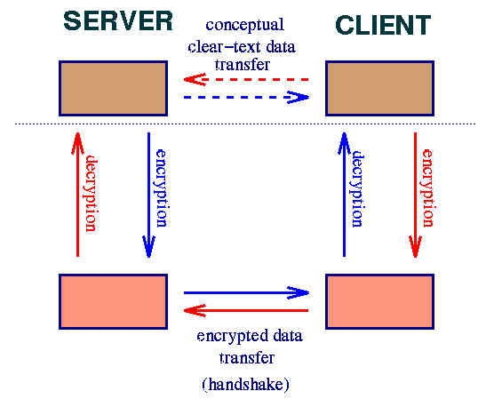
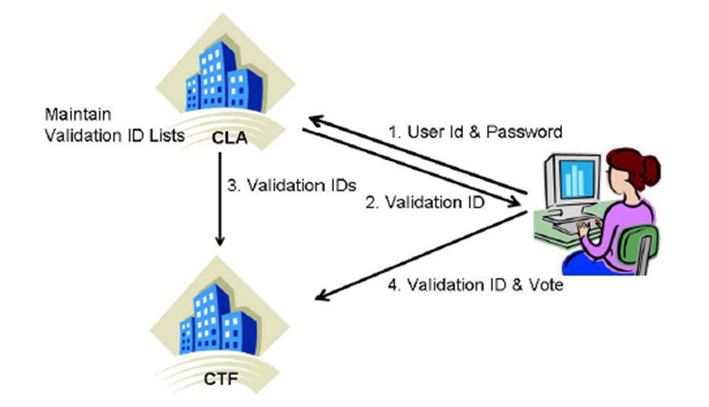

# CS5780-Projects

    
Project 1 - Simplified SSL (Secure Socket Layer)

[README.md](Project1/README.md)

Conceptually a Secure Socket Layer can be thought of as a pair of sockets between a server and a client where communication on the actual network socket is secure.

Clever implementation can actually hide the mess of encryption, decryption, and key exchange protocol entirely. As far as the server is concerned, it only wants to know if the client is authorized and receive and send data in clear-text even though the actual bytes on the network are encrypted. As far as the client is concerned, it only wants to know that it is connected to the real server and also wants to exchange data in clear-text even though the physical bytes transmitted are encrypted.

    
Project 2 - Secure Election System

[README.md](Project2/README.md)

In this project, you will implement the secure election protocol with two central facilities described in class using Java, The implementation will provide a secure way for people to vote electronically, which eliminates the hassle of physically being present at designated election locations.

